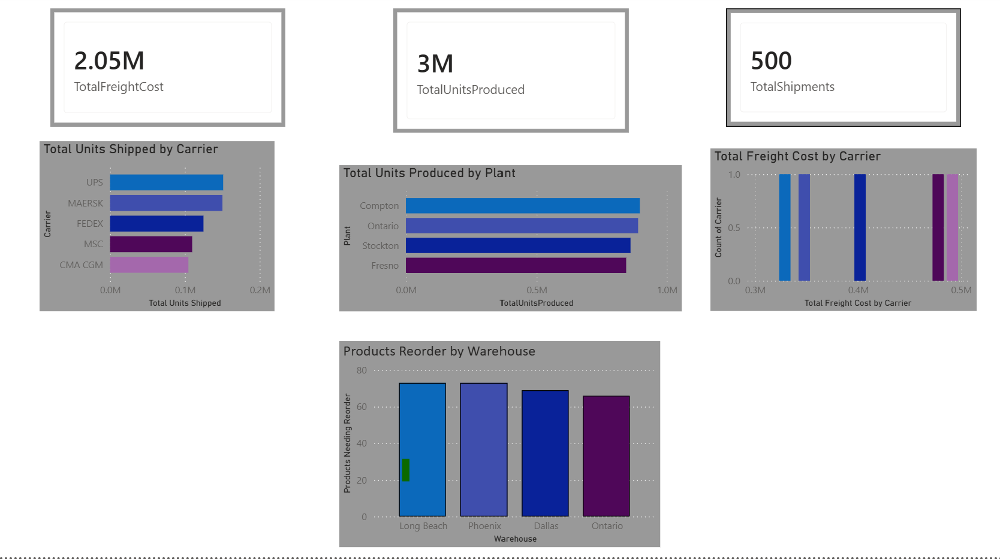

# Manufacturing Supply Chain Data Platform

## Overview
This project simulates a manufacturing company's end-to-end supply chain data platform.

The pipeline automatically:

- Generates shipment data
- Generates production data
- Generates inventory data
- Cleans and validates data
- Loads into SQLite
- Creates SQL Views
- Exports reporting datasets
- Powers a Power BI dashboard

---

## Tech Stack

Python
Pandas
SQLite
SQL
Power BI
Git
GitHub

---

## Project Architecture

Raw Data
↓
Extract
↓
Transform
↓
Validate
↓
SQLite Database
↓
SQL Views
↓
CSV Export
↓
Power BI Dashboard

---

## Features

✔ Automated ETL Pipeline

✔ Data Validation

✔ SQLite Database

✔ SQL Views

✔ Power BI Dashboard

✔ Logging

✔ Modular Python Scripts

---

## Dashboard

---

## Future Improvements

- Airflow scheduling
- Docker containerization
- Azure SQL
- Power BI Service
- Email alerts
